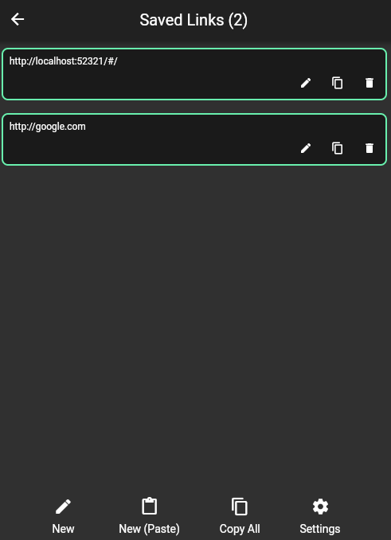

# Sinote

A minimalistic note taking application written with Flutter.

## Considerations

This project is currently a proof-of-concept. As a result:

- All data is currently stored in shared preferences
- The password-protection feature simply hashes the password; this is NOT secure!

## Screenshots

